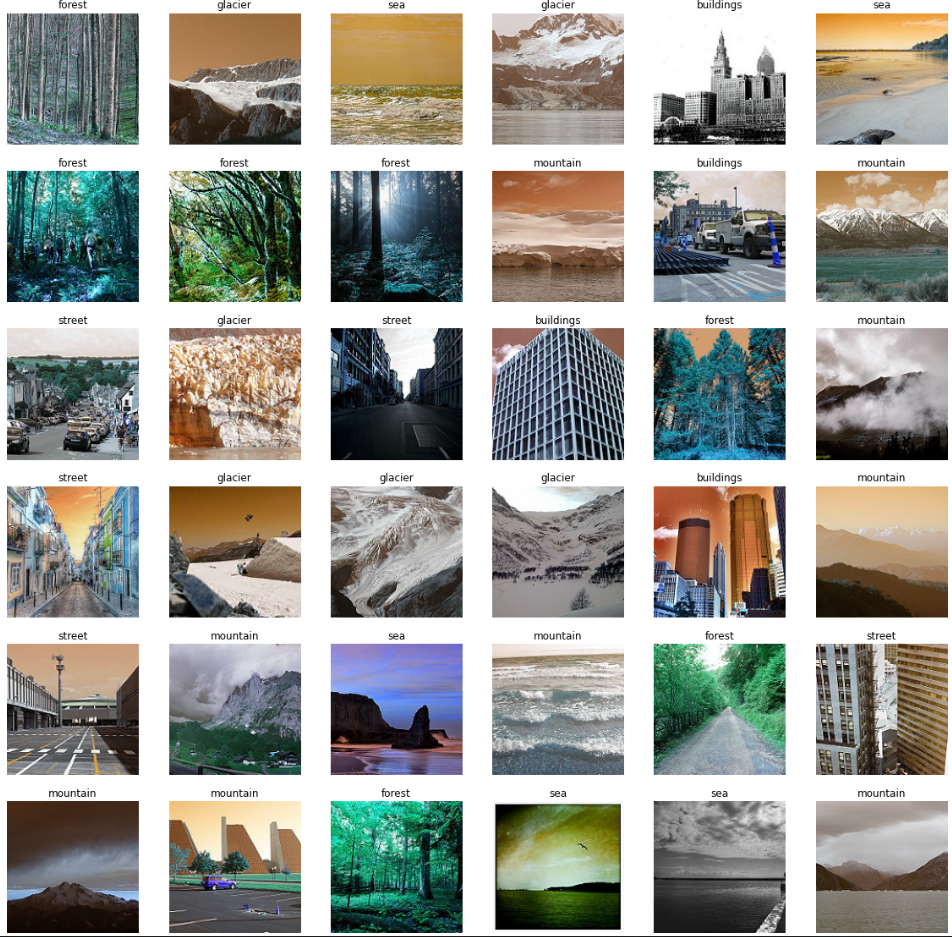

# Convolutional Neural Network Image Classification
- Convolutional Neural Networks are a form of Deep Learning where "neural networks" are trained for classification
# Dataset
- The dataset used was referenced from Kaggle and can be found [here](https://www.kaggle.com/puneet6060/intel-image-classification)
- This Data contains around 25k images of size 150x150 distributed under 6 categories.
- {'buildings' -> 0,'forest' -> 1,'glacier' -> 2,'mountain' -> 3,'sea' -> 4,'street' -> 5 }.
- The Train, Test and Prediction data is separated in each zip files. There are around 14k images in Train, 3k in Test and 7k in Prediction.
This data was initially published on https://datahack.analyticsvidhya.com by Intel to host a Image classification Challenge.

# Code and Resources Used
- Python 3.7
	- Packages: pandas, numpy, matplotlib, keras, tensorflow
- Jupyter Notebook

# Results
- The neural network I created consisted of Convolutional layers and MaxPooling Layers
- The model had a **test accuracy** of **75%** in just 5 epochs.
- The model can significantly improve it's accuracy given more training time and more epochs ran.
- Below are some of the results the model predicted from the jupyter notebook:

- From the image above, we can see that the model predicts decently well.
- However, the model has some trouble differentiating between **streets** and **buildings**, this is due to the fact that in some of the photos (training data) the streets have buildings in them
- As a result, the model does not correctly predict streets and buildings sometimes. 
